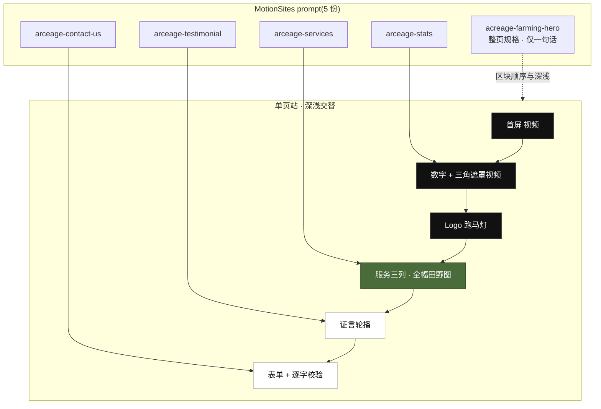

# Acreage(acreage.<BASE_DOMAIN>)

> 🌐 在线示范:**[acreage.golive-gallery.art](https://acreage.golive-gallery.art)**(本仓库官方实例;教程正文用 `<BASE_DOMAIN>` 占位,fork 后换成你的域名)
>
> 站点:[`sites/acreage`](../../sites/acreage) · 部署:Cloudflare Pages(平台直连 Git)· 素材:MotionSites prompt 库
>
> 本篇是第二个示范站的完整实战。与 [Reverie 篇](dreamcore.md) 是刻意的对照——那站是**一个整页 prompt 摊成八页**,这站是**五个 prompt 收成一页**。部署原理不重复,随文引用 [00 · 基础](../guide/00-basics/README.md)、[Cloudflare Pages 篇](../guide/01-free-hosting/cloudflare-pages.md)。

## 成品与架构

一家虚构的精准农业收割服务公司。单页锚点站,六个区块按「深 → 浅」交替:视频首屏 → 黑底数字 → Logo 跑马灯 → 全幅田野图上的服务区 → 白底证言轮播 → 白底表单。技术栈 React 19 + TS + Vite + Tailwind v4 + `motion/react`,无路由(官方设计就是单页,导航胶囊里的 `Feedback` / `Contact Us` 对应 prompt 里写死的 `#feedback` / `#contact`)。



## 一、区块家族拼装法

第一站的方法是「选一份规格极密的整页 prompt,照做,再按叙事需要扩展页面」。这站行不通——因为**整页 prompt 的正文只有一句话**:

> Precision farming landing page with dark/light sections, hero video background, stats grid, logo marquee, and service cards.

没有一行 CSS。真正的实现散在同品牌的四个区块 prompt 里。所以方法反过来:**先把家族凑齐,再按整页规格排序**。

### 1. 顺藤摸瓜找家族

区块 prompt 不会自己跳出来,它们分散在 Services / Stats / Testimonials / Form 四个不同分类下。找到入口靠的是相似风格反查:

```
get_related_prompts("custom-spaces")   ← 从一个风格接近的整页 prompt 反查
   → 结果里出现 arceage-services / arceage-testimonial / arceage-contact-us
search_prompts("arceage")              ← 拿到前缀,一次捞全四件套
```

**一个站由多个 prompt 拼成,`site.yaml` 的 `source.promptId` 就要收得下多个**——所以 schema 里这个字段放宽成了「字符串或数组」:

```yaml
source:
  generator: motionsites
  promptId:
    - acreage-farming-hero   # 整页规格:dark/light 交替、视频首屏、数字、跑马灯、服务卡
    - arceage-stats          # 数字区(黑底)
    - arceage-services       # 服务区(全幅田野图)
    - arceage-testimonial    # 证言轮播(覆写为白底)
    - arceage-contact-us     # 表单 + 逐字校验图标(覆写为白底)
  assets: cdn
```

### 2. 整页规格决定排序与深浅,区块规格决定长相

这是两类 prompt 的分工,**缺了整页规格就没人告诉你区块之间怎么排**:

| 问题 | 谁回答 |
|---|---|
| 有哪些区块、什么顺序 | 整页规格 |
| 哪一块深、哪一块浅 | 整页规格(`dark/light sections`) |
| 首屏是图还是视频 | 整页规格(`hero video background`) |
| 这一块的字号、间距、动效参数 | 区块规格 |

四个区块 prompt 里有两个明写了 `This section overrides to bg-white text-black`——照做就自动得到深浅节奏,不用自己拿捏。

### 3. 共用组件从规格里长出来,别各写各的

四份规格反复出现同一个 `Typewriter` 组件(逐字显现,`useInView` 触发,parent/child variants 完全一致)。这是设计系统在告诉你哪些东西该抽出来:

```
components/Typewriter.tsx       ← 四份规格共用,抽一次
components/AnimatedCounter.tsx  ← stats 规格里的 0→目标值滚动
components/LottieIcon.tsx       ← services 规格里的三个图标
lib/assets.ts                   ← 所有外部素材集中登记
```

### 4. 素材仓是杂物堆,逐个核对

`Acreage-landing-assets` 这个仓库被多个 prompt 共用,不是农业专属。里面 `0098888.jpg` / `202604201031 1.jpg` / `02604201313.png` **全是同一张 Nike 球鞋渲染图**(给另一个 `nike-hover` prompt 用的),既跑题又带真实品牌。

真正能用的只有四类:虚化田野底图、玉米地实拍视频、三个 Lottie 图标、表单的对勾/叉号 SVG。全部**直接引用素材方 CDN,不下载入仓**(`site.yaml` 标 `assets: cdn`),集中登记在 [`src/lib/assets.ts`](../../sites/acreage/src/lib/assets.ts) 一处,换素材只改这个文件。

### 5. 没提供的素材要标注替换,不要假装是原设计

整页规格说了 `hero video background`,但**没给视频**——官方预览里那段农庄建筑实拍不在素材清单内。这里用了清单里的玉米地实拍(竖版,`object-cover` 裁中段)顶上,并在组件注释里写明这是替换,不是原素材。

### 6. 品牌标识:规格里有,但没告诉你放哪

三角山形的 SVG path 直接写死在 `arceage-stats` 规格里(它拿这个形状当视频遮罩)。官方页面只在导航胶囊正中放了这个图形,**不带字标**——光一个三角,访客不知道公司叫什么。

所以做了一处克制的加法:字标单独放首屏左上、与胶囊同一水平线,既让首屏就报出名字,又不破坏胶囊的居中对称。favicon 也从 emoji 换成同一个 path,并且是**构建时从 `assets.ts` 读出来生成**的,不是复制一份——改 logo 不会两边漂移。

## 二、最大的教训:检索不到 = 不存在

第一次搜索只试了 `arceage` 这个**拼错的**家族前缀,没试 `acreage`,结果**漏掉了 `acreage-farming-hero` 这条整页规格**。

看不到整页规格,就等于没人告诉我区块怎么排、哪里深哪里浅。后果是一路自由发挥:

| 我做的 | 原设计 |
|---|---|
| 自己编的首屏(模糊图 + 重渐变 + 自写文案) | 视频背景 + 左标题 + 右信息面板 + 底部信息栏 |
| 全宽黑色导航条 | 居中悬浮胶囊 |
| 没做 Logo 跑马灯 | 有,是整页规格里点名的一块 |
| 服务区加 `bg-black/55` 压暗 | **无遮罩**,田野图直接作底 |
| 自己编了四个页面、改了服务文案与数字 | 单页,文案与数字规格里都有 |

全部返工重做。沉淀成两条判据:

1. **动手前先确认「整页规格」是否存在。** 区块 prompt 只说这一块长什么样,整页规格才说区块之间怎么排。找不到整页规格时,先当作「可能存在但没搜到」,而不是「不存在,我来编」。
2. **搜索要把拼写变体一起试。** 库是人建的,id 会拼错;检索不到的东西,对 AI 而言就等于不存在。

还有一条更朴素的:**照着 prompt 走,别自己加戏**。那层 `bg-black/55` 是「我觉得这样文字更清楚」加上去的,结果把整块的绿压没了——规格里没有的东西,加之前先问为什么原作者没加。

## 三、部署链路

完整步骤见 [Cloudflare Pages 篇](../guide/01-free-hosting/cloudflare-pages.md),这里只记本站的具体值与实测结果。

| 项 | 值 |
|---|---|
| 平台项目名 | `golive-acreage`(与 `site.yaml` 的 `deploy.project` 一致,`golive check` 会校验) |
| Root directory | `sites/acreage` |
| Build command / output | `npm run build` / `dist` |
| Node | `NODE_VERSION=22.16.0`(站内另有 `.node-version`) |
| 自定义域名 | `acreage.<BASE_DOMAIN>`,DNS 同账号自动写入 |

首次构建实测:`npm ci` 89 包 → Vite 构建 4.61s → 上传 5 个文件 → 部署成功,全程约 30 秒。

**一处工程注记**:`@lottiefiles/react-lottie-player` 会把整个 `lottie-web` 压进主包(804 kB / gzip 225 kB)。改成 `lazy()` 懒加载后拆成独立 chunk,主包降到 355 kB / gzip 114 kB——三个装饰性图标不该让首屏买单。

## 四、上线核验清单

```bash
D=acreage.<BASE_DOMAIN>
dig @1.1.1.1 $D +short                     # 解析生效
echo | openssl s_client -connect $D:443 -servername $D 2>/dev/null \
  | openssl x509 -noout -subject -dates     # 证书签给这个域名
curl -s -o /dev/null -w "HTTP/%{http_version} %{http_code}\n" "https://$D/"
curl -sI "http://$D/" | head -1            # HTTP 应 301 到 HTTPS
```

浏览器里再走一遍(带手机):

- [ ] 四个锚点区块都有内容,不是空白(`whileInView` 类动效若配置不当会让区块停在 `opacity: 0`)
- [ ] 导航胶囊浮到白色区块上时文字仍可读
- [ ] 点 `Contact Us`,表单区没有被悬浮导航盖住顶部
- [ ] 表单填非法邮箱失焦出红叉,改合法出绿勾
- [ ] 跑马灯循环处看不出接缝
- [ ] 控制台零报错

本站上线时这份清单全部实测通过,表单校验是用真实键盘输入验的——**合成 `blur` 事件不会触发 React 的 `onBlur`**(它走 focusout 委托),用合成事件测会得到「图标不出现」的假阴性。
