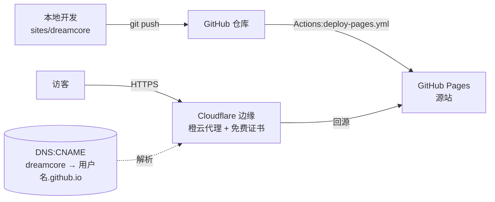

# Reverie(dreamcore.<BASE_DOMAIN>)

> 🌐 在线示范:**https://dreamcore.golive-gallery.art**(本仓库官方实例;教程正文用 `<BASE_DOMAIN>` 占位,fork 后换成你的域名)
> 站点:[`sites/dreamcore`](../../sites/dreamcore) · 部署:GitHub Pages + Cloudflare 解析 · 素材:MotionSites prompt 库
>
> 本篇是第一个示范站从 0 到上线的完整实战。通用原理不重复,随文引用 [00 · 基础](../guide/00-basics/README.md)、[GitHub Pages 篇](../guide/01-free-hosting/github-pages.md)、[Cloudflare 解析篇](../guide/01-free-hosting/custom-domain-cloudflare.md)。

## 成品与架构

一家"贩卖梦境的旅行社":480vh 滚动叙事主页(拉幕 → 穿越传送门 → 九条航线摩天轮)+ 七个子页面,全站零死链。技术栈 React 18 + TS + Vite + Tailwind v4 + Hash 路由(站点级细节见 [`sites/dreamcore/README.md`](../../sites/dreamcore/README.md),含页面跳转逻辑图)。



## 一、MCP 组合建站法(本站最大的方法论沉淀)

只把一条 prompt 粘给 AI,得到的是一张"漂亮的纸"——能看,不能点。本站的做法是**把 prompt 库当积木库用**,六步:

### 1. 选主 prompt:看规格密度,不只看预览图

用 MCP 的 `list_prompts`(featured/popular 两个池)捞候选,`get_prompt` 拉全文后先审**规格密度**:好的 prompt 是工程规格书——精确到资产 URL、缓动曲线、视差系数、逐断点布局。规格越密,还原上限越高。本站选中 `dreamcore-landing`,其滚动机制精确到"portal 缩放 7.5 倍、origin 52%/38%、65%–85% 进度区间淡出"。

### 2. 忠实还原,资产直用 CDN

工程级 prompt 照规格实现,不自由发挥;图片视频直接引用 prompt 里给的 CDN URL,不下载入仓(仓库不膨胀,且素材方许可允许)。**还原完必须浏览器实拍验证**——本站第一版就在实拍里抓出"手机端内联 display 压过响应式类导致三档 UI 叠渲"的真 bug。

### 3. 找"纸感":列出所有假交互

滚一遍页面,记下所有"看起来能点但点不动"的元素。本站清单:导航六项、摩天轮九张卡、三张 View Reel 卡——共三类死交互。

### 4. 画页面地图:每个死交互给一个叙事归宿

先定主题(本站:梦境旅行社),再按叙事给每个死交互分配目的地:九张卡 → 航线详情页;"预约" → 表单页;"手记" → 旅行日志……主题让页面清单不是功能堆砌,而是一个世界观。

### 5. 逐页配基底:按视觉风格检索,统一改造

对每个新页面,用 `search_prompts` **按视觉风格描述**检索(它按设计风格排序,"booking form elegant minimal luxury" 这类查询很好使),每页选一条 prompt 作视觉基底,然后统一改造:同一块底色、同一组点缀色、同一对字体、同一种文案 voice。基底各不相同,成品像一家人。本站八页与基底的对照表见[站点 README](../../sites/dreamcore/README.md)。

### 6. 交互闭环:所有路汇入一个收口

站内任何页面都能自然走到转化点(本站是 /reserve 预约页);动态路由给未知参数留兜底页,不许白屏。全站接线后再滚一遍第 3 步的清单,逐项打勾清零。

> 工程配合:页面数据收敛单一真相源(本站 `data/voyages.ts` 同时驱动主页摩天轮、目录页、详情页);多页用 Hash 路由,静态托管免服务端配置。

## 二、部署链路

1. 脚手架:`npx golive new dreamcore -t github-pages`(生成站点目录 + site.yaml + 本篇骨架)
2. 部署流水线:[`.github/workflows/deploy-pages.yml`](../../.github/workflows/deploy-pages.yml),push 即发布 —— 细节见 [GitHub Pages 篇](../guide/01-free-hosting/github-pages.md)
3. 域名:腾讯云注册,NS 托管 Cloudflare,CNAME `dreamcore → <用户名>.github.io` 橙云代理,HTTPS 由 CF 边缘提供 —— 全流程见 [Cloudflare 解析篇](../guide/01-free-hosting/custom-domain-cloudflare.md)

## 三、上线核验清单

```bash
cd sites/dreamcore && npm run build          # ① 本地构建绿(tsc 严格检查 + vite build)
gh run list --workflow deploy-pages.yml -L1  # ② 部署 workflow 绿
dig +short dreamcore.<BASE_DOMAIN>           # ③ 解析到 CF 代理 IP
curl -s -o /dev/null -w '%{http_code}\n' --compressed https://dreamcore.<BASE_DOMAIN>/   # ④ 端到端 200
```

再用浏览器(带手机)真开一遍:锁标志、逐路由点一圈、乱输一个航线 slug 看兜底页。**改完配置"没生效"先读[缓存心法](../guide/01-free-hosting/custom-domain-cloudflare.md#五缓存心法改完没生效九成不是坏了)再动手**。

---

**学会原理后,一条命令搞定**:`npx golive deploy dreamcore --dry-run` 打印的底层命令与本篇部署段一一对应。素材溯源(prompt 编号、资产形态)登记在 [`site.yaml`](../../sites/dreamcore/site.yaml)。
