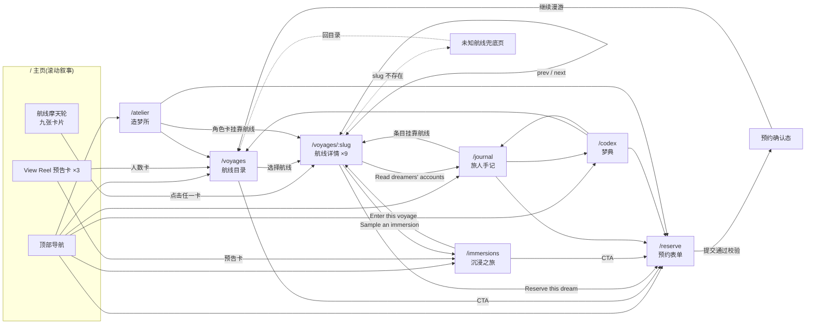

# Reverie · A Dream Travel Agency

> 一家「贩卖梦境的旅行社」——为清醒得太久的人,定制一场认真做完的梦。

## 基本信息

| 项 | 值 |
|---|---|
| 子域名 | `dreamcore.<BASE_DOMAIN>`(根域名经 `.env` 的 `GOLIVE_BASE_DOMAIN` 注入) |
| 部署方式 | GitHub Pages(`.github/workflows/deploy-pages.yml`,push 即发布) |
| 技术栈 | React 18 · TypeScript · Vite · Tailwind CSS v4(`@tailwindcss/vite`)· react-router(Hash 路由) |
| 设计来源 | [MotionSites](https://motionsites.ai) prompt 库:主页基于 `dreamcore-landing`,七个子页各以一条 prompt 为视觉基底(见下表),统一改造成 Reverie 主题 |
| 静态资产 | 直接引用素材方 CDN,不入仓(会员协议允许非商用使用) |
| 字体 | Viaoda Libre(展示衬线)+ Imprima(正文),Google Fonts |

## 页面与视觉基底

| 路由 | 页面 | 视觉基底 prompt |
|---|---|---|
| `/` | 主页:480vh 滚动叙事(拉幕 → 穿门 → 航线摩天轮) | `dreamcore-landing` |
| `/voyages` | 航线目录(九条梦境航线的玻璃卡阵) | `orbis-cards` |
| `/voyages/:slug` | 航线详情(编辑排版,未知 slug 有兜底页) | `editorial-collection-cta` |
| `/reserve` | 预约表单(校验 + 确认态,支持 `?voyage=` 预填) | `arceage-contact-us` |
| `/immersions` | 沉浸之旅(传送门滚动 + 三张 reel 卡) | `gateway-portal` |
| `/journal` | 旅人手记(梦旅日志列表) | `blog-showcase` |
| `/codex` | 梦典(bento 网格的品牌宇宙数据) | `bento-grid-stats` |
| `/atelier` | 造梦所(视频 hero + 三道工序 + 三个角色) | `immersive-studio` |

## 跳转与交互逻辑



要点:**所有路径最终汇入 `/reserve`**(转化收口);九条航线详情是全站的枢纽节点(目录、手记、梦典、造梦所、沉浸页都向它引流);失败路径显式——未知 slug 不白屏,表单空项有提示。

## 本地运行

```bash
cd sites/dreamcore
npm i && npm run dev      # 开发
npm run build             # 构建(tsc 严格检查 + vite build)
npm run preview           # 预览构建产物
```

## 元数据

站点清单(部署目标、子域名、素材溯源)见 [`site.yaml`](site.yaml);从 0 到上线的完整实战教程(含 MCP 组合建站法)见 [`docs/sites/dreamcore.md`](../../docs/sites/dreamcore.md)。
